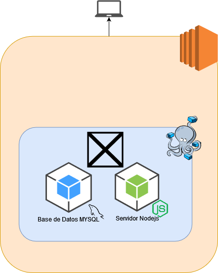

# challenge-nodejs
 
## Tabla de Contenido

> * [Tabla de contenido](#Tabla-de-Contenido)
> * [Requerimientos](#Requerimientos)
> * [Diseño del sistema](#Diseño-del-sistema)
> * [Correr el sistema](#Correr-el-sistema)
>   * [Server](#Server)
>   * [Tests](#Tests)
---


## Requerimientos

- Docker v19.03.2
- Docker Compose v1.24.1
- Npm v6.14.6
- Node >=v12.18.3
- Variables de entorno:
  - `db_name`: usuario para base de datos
  - `db_password`: contraseña de usuario
  - `db_database`: `mutant_log`


## Diseño del sistema

Se utilizo una máquina virtual de AWS EC2 para correr la API. 
SE uso docker y docker-compose para contenerizar la API nodejs y una base de datos MYSQL.




## Correr el sistema

Ya teniendo instalado Docker y docker-compose en la computadora correr el siguiente comando donde se encuentra el archivo docker-compose.yml

```
sudo docker-compose up
```

### Test
Para correr las pruebas de forma local solo hacer:

Instalar dependencias
```
npm i
```
Correr las pruebas
```
npm run test
```